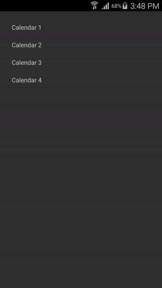
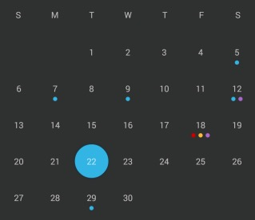
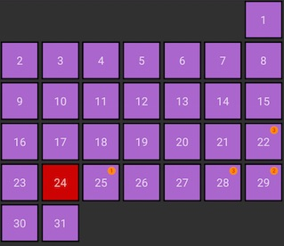
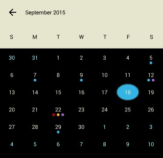
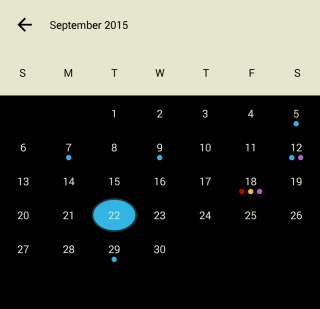

# FlexibleCalendar

[](https://gitter.im/p-v/FlexibleCalendar?utm_source=badge&utm_medium=badge&utm_campaign=pr-badge&utm_content=badge) [](https://android-arsenal.com/details/1/2323)

A customizable calendar for android with customizable events.



**Gradle**

Add dependencies in `build.gradle`,

```groovy
dependencies {
    compile 'com.p_v:flexiblecalendar:1.2.1'
}
```

Customize **FlexibleCalendar** using the **CalendarView** interface

```java
calendarView.setCalendarView(new FlexibleCalendarView.CalendarView() {
    @Override
    public BaseCellView getCellView(int position, View convertView, ViewGroup parent, int cellType) {
        //customize the date cells
        BaseCellView cellView = (BaseCellView) convertView;
        if (cellView == null) {
            LayoutInflater inflater = LayoutInflater.from(CalendarActivity4.this);
            cellView = (BaseCellView) inflater.inflate(R.layout.calendar3_date_cell_view, null);
        }
        if (cellType == BaseCellView.TODAY){
            cellView.setTextColor(getResources().getColor(android.R.color.holo_red_dark));
            cellView.setTextSize(15);
        } else {
            cellView.setTextColor(getResources().getColor(android.R.color.white));
            cellView.setTextSize(12);
        }
        return cellView;
    }
    @Override
    public BaseCellView getWeekdayCellView(int position, View convertView, ViewGroup parent) {
        //customize the weekday header cells
        BaseCellView cellView = (BaseCellView) convertView;
        if (cellView == null) {
            LayoutInflater inflater = LayoutInflater.from(CalendarActivity4.this);
            cellView = (BaseCellView) inflater.inflate(R.layout.calendar3_week_cell_view, null);
            cellView.setBackgroundColor(getResources().getColor(android.R.color.holo_purple));
            cellView.setTextColor(getResources().getColor(android.R.color.holo_orange_light));
            cellView.setTextSize(18);
        }
        return cellView;
    }
    @Override
    public String getDayOfWeekDisplayValue(int dayOfWeek, String defaultValue) {
        return String.valueOf(defaultValue.charAt(0));
    }
});
```

Display events for a day using the **EventDataProvider**

```java
calendarView.setEventDataProvider(new FlexibleCalendarView.EventDataProvider() {
    @Override
    public List<? extends Event> getEventsForTheDay(int year, int month, int day) {
        return getEventColorList(year,month,day);
    }
});
```
Track the month change event by setting the **OnMonthChangeListener**
```java
calendarView.setOnMonthChangeListener(new FlexibleCalendarView.OnMonthChangeListener() {
    @Override
    public void onMonthChange(int year, int month, int direction) {
        //do things on month change
    }
});
```

**Customizations:**

Display events in different styles.

 &nbsp; 

Customize the cells and events by extending the class **BaseCellView**. 

Existing cells include **CircularEventCellView**, **SquareCellView** and **EventCountCellView**.

Choose whether to show dates outside month or not by setting the `showDatesOutsideMonth` flag,
 using `FlexibleCalendarView#showDatesOutsideMonth()` method.

Set the first day of the week using `FlexibleCalendarView#setStartDayOfTheWeek` method or through xml
 by setting the attribute `startDayOfTheWeek`.

Disable auto date selection on month change by using `FlexibleCalendarView#disableAutoDateSelection` method or through xml by using `disableAutoDateSelection`.

 &nbsp; 

**Navigate the calendar:**

`selectDate` - Scroll and select the provided date
`goToCurrentDay` - Go the the current day <br/>
`goToCurrentMonth` - Go the the current month <br/>
`moveToNextDate` - Select the date after the current selection <br/>
`moveToPreviousDate` - Select the date before the current selection <br/>
`moveToNextMonth` - Move the view to the next month from the current visible month <br/>
`moveToPreviousMonth` - Move the view to the previous month from the current visible month <br/>

**Customizable display cells with different states:**

`state_date_regular` - Regular date<br/>
`state_date_today` - Today's date<br/>
`state_date_selected` - Selected date<br/>
`state_date_outside_month` - Date lying outside month but in current month view<br/>

**Sample cell background:**

```xml
<?xml version="1.0" encoding="utf-8"?>
<selector xmlns:android="http://schemas.android.com/apk/res/android"
    xmlns:flexible="http://schemas.android.com/apk/res-auto">
    <item flexible:state_date_regular="true"
        android:drawable="@drawable/cell_purple_background"/>
    <item flexible:state_date_today="true"
        android:drawable="@drawable/cell_gray_background"/>
    <item flexible:state_date_selected="true"
        android:drawable="@drawable/cell_red_background"/>
    <item flexible:state_date_outside_month="true"
        android:drawable="@drawable/cell_blue_background"/>
</selector>
```
